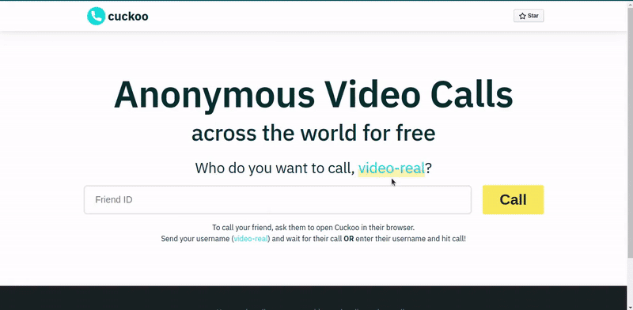

<div align="center">
  
<a href="https://cuckooapp.herokuapp.com">
  
</a>

# Cuckoo - Anonymous, Free Video Calls

Anonymous video calls across the world for free with screensharing!
  
<a href="https://github.com/somikdatta/cuckoo/fork" target="blank">

</a>

<a href="https://github.com/somikdatta/cuckoo/stargazers" target="blank">

</a>

<a href="https://github.com/somikdatta/cuckoo/issues" target="blank">

</a>

<a href="https://github.com/somikdatta/cuckoo/pulls" target="blank">

</a>

<br/>
<br/>

<a href="https://cuckooapp.herokuapp.com/" target="_blank">View Cuckoo</a> · <a href="https://github.com/somikdatta/cuckoo/issues/new/choose" target="_blank">Report Bug</a> · <a href="https://github.com/somikdatta/cuckoo/issues/new/choose" target="_blank">Request Feature</a>

✨ _Loved the project? Give this project a star to show your support._ ✨



</div>

---

Cuckoo is a small project to demonstrate the concepts of WebRTC, WebSockets by facilitating video calls across the web!
---

## 🧐 Feature list

-   [x] Video Call
-   [x] Screen Sharing
-   [ ] Select camera
-   [ ] Select audio device

## 🚀 Getting started

This project is deployed at https://cuckooapp.herokuapp.com

Guide for local deployment -

1. Clone the repository
```bash
git clone https://github.com/somikdatta/cuckoo.git
```
2. Change the working directory
```bash
cd cuckoo
```
3. Install dependencies
```bash
npm install
```
4. Change the working directory
```bash
cd client
```
5. Install dependencies
```bash
yarn install
```
6. Run the app
```bash
npm start in parent directory /cuckoo
```
```bash
yarn start in directory /cuckoo/client
```
7. Open project at http://localhost:3000

🌟 You are all set!

## 🙇 Special Thanks 
- [Coding with Chaim](https://github.com/coding-with-chaim/) for explaining the concepts of WebSockets and WebRTC on his [YouTube Channel](https://www.youtube.com/channel/UC7sCgeZ9xOwCGHIp2mVWlUQ)

## ❤️ Support

If you happen to love this project, leave a star on the repo. That'll keep me motivated. Let me know your thoughts with a tweet. Mention me [@somikdatta](https://twitter.com/somikdatta).

Thanks!

Contributions are welcomed!

<div align="center">
Developed with ❤️ in India 🇮🇳 
</div>
